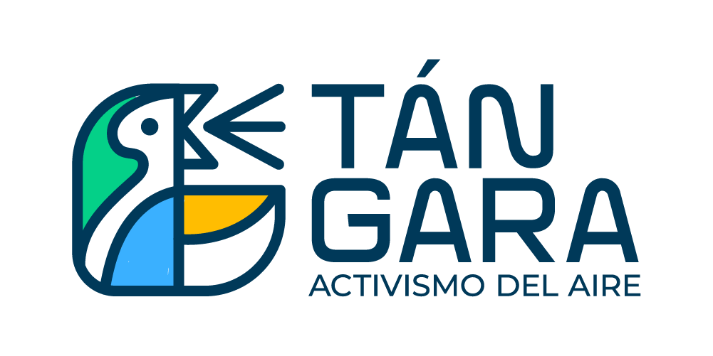

# tangara-evaluation
Base code to evaluate Tangara's sensors by comparing them through a time series, identifying missing data, detecting outliers, and assessing offline sensors.

[](https://tangara.chis.pa/)

## Requirements

* Python 3.8+
* Poetry 1.7+
    - [Install Poetry](https://python-poetry.org/docs/#installation)

## How to use

Please read and execute each step below:

### Step 1

Add Poetry to your PATH:

```bash
$promt> export PATH="$HOME/.local/bin:$PATH"
```

Also you can add Poetry to your .bashrc file:

```bash
$promt> nano ~/.bashrc
```

Install poetry by script:

```bash
$promt> ./install-poetry.sh
```

### Step 2

Command to tell Poetry which Python version to use for the current project:

```bash
$promt> poetry env use 3.12
```

### Step 3

Activating the virtual environment:

```bash
$promt> poetry shell
```

### Step 4

Installing dependencies:

```bash
$(tangara-evaluation-py3.12)> poetry install --no-root
```

### Optional

Displaying the environment information:

```bash
$promt> poetry env info
```

Adds required packages to your pyproject.toml and installs them:

```bash
$promt> poetry add jupyter
```

Deactivate the virtual environment and exit:

```bash
$(tangara-superset-py3.12)> exit
# To deactivate the virtual environment without leaving the shell use deactivate
$(tangara-superset-py3.12)> deactivate
```

---

## Tangara Evaluation

A base code was created inside the folder **src** please check out the [README.md](src/README.md) file.

---

***That's all for now ...***

---

#### License

[GPL-3.0 License](./LICENSE)

#### About me

[https://about.me/sebaxtian](https://about.me/sebaxtian)
